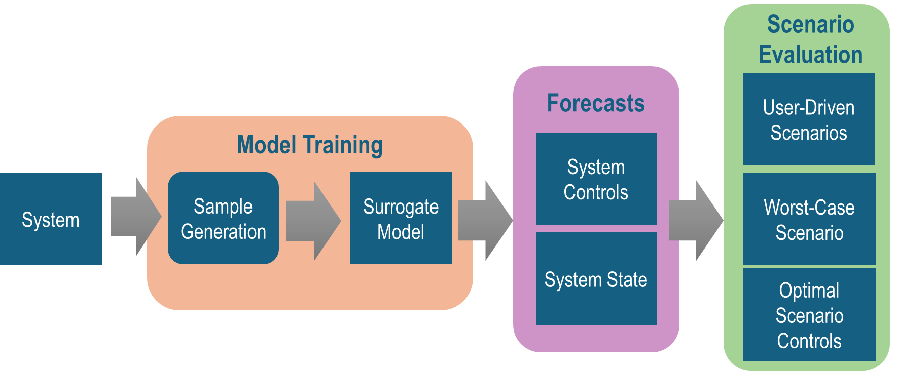

<!-- 

    <h1>Surrogate Models: Part 1</h1>
    
Understanding the Basics of Surrogate Modeling

 -->

# Introduction
Welcome to the first part of our series on surrogate modeling. This is a field I work in daily, and I'm excited to share it with you!

Surrogate modeling involves building a model that is faster or less complex to evaluate than the original physical or digital system. These systems are often very expensive to run (e.g., carbon capture factories, accelerator beams, large climate models) or impractical to use as analysis tools due to long compute times [1,2,3]. However, insights from these systems need to be analyzed for future states, control parameters, or experimental designs.

Often, these systems have user-specified parameters. This raises the question: "How do I select parameters to optimize some quantity X?" For example, maximizing profit margins or minimizing emissions [4,5]. This question leads to the problem of optimization with surrogate models, which I'll discuss in later articles.

Additionally, there might be questions about contributing or significant factors that lead to a specified outcome, such as "What compound in this factory leads to the most emissions?" or "Do weather conditions in Kansas affect the conditions in Wisconsin?" These questions relate to developing a faster, lower-fidelity surrogate model that enables queries that can't be done on the original system due to its complexity.

    
    
     
    <caption> DALLE-3's interpretation of surrogate models</caption>

# Overview of Surrogate Models
In the remainder of this series, I'll describe the important components of surrogate modeling at a high level: Model Training, Forecasts, and Scenario Evaluation.

# References
1. Wiesberg, I. L., de Medeiros, J. L., de Mello, R. V. P., Maia, J. G. S., Bastos, J. B. V., & Ofélia de Queiroz, F. A. (2021). Bioenergy production from sugarcane bagasse with carbon capture and storage: Surrogate models for techno-economic decisions. Renewable and Sustainable Energy Reviews, 150, 111486.
2. Adelmann, A. (2019). On nonintrusive uncertainty quantification and surrogate model construction in particle accelerator modeling. SIAM/ASA Journal on Uncertainty Quantification, 7(2), 383-416.
3. Schär, C., Frei, C., Lüthi, D., & Davies, H. C. (1996). Surrogate climate‐change scenarios for regional climate models. Geophysical Research Letters, 23(6), 669-672.
4. Peitz, S., & Dellnitz, M. (2018). A survey of recent trends in multiobjective optimal control—surrogate models, feedback control and objective reduction. Mathematical and computational applications, 23(2), 30.
5. Alizadeh, R., Allen, J. K., & Mistree, F. (2020). Managing computational complexity using surrogate models: a critical review. Research in Engineering Design, 31(3), 275-298.